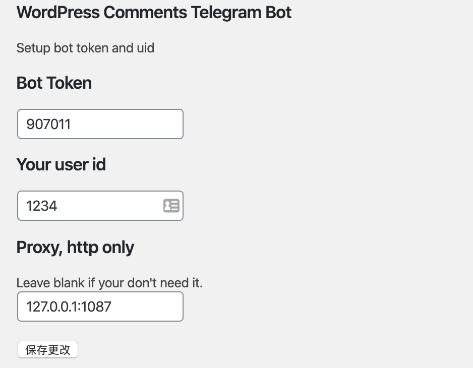

# wp-comments-tgbot
A Telegram Bot for WordPress comments!

# Warning
By using this plugin, you agreed to open Basic Auth on your WordPress.

Please setup a complex passphrase for your WordPress

# Requirements
1. WordPress native comment system.

2. Network connection to Telegram.

# General guide
## 1. Install plugin
ssh to your blog
```shell script
cd /path/to/root/wp-content/plugins
git clone https://github.com/BennyThink/wp-comments-tgbot
``` 

Then navigate to your Plugin and enable WordPress Comments Telegram Bot.
## 2. Create bot and find your user id
Talk to [@BotFather](https://t.me/BotFather), create your own bot and copy bot token.

Talk to [@get_id_bot](https://t.me/get_id_bot), get your own user id.

## 3. Edit configuration on WordPress
Fill in your token, user id and proxy if needed.


## 3. Download binary on GitHub Release
[GitHub Release](https://github.com/BennyThink/wp-comments-tgbot/releases)

## 4. Create config
Create your own `config.json`
```json
{
  "username": "admin",
  "password": "admin",
  "url": "http://localhost/",
  "token": "907J6Tw",
  "uid": "23231321",
  "admin": 1,
  "tail": "本评论由Telegram Bot回复～❤️"
}
```
Explanations:
* username & password: username and password for WordPress
* url: site url, must include `/` as suffix.
* token: Telegram bot token
* uid: your Telegram user id
* admin: your user id in WordPress, typically it should be 1
* tail: suffix message to your reply.

## 5. Run
Supply `config.json` as `-c /path/tp/config.json`. By default it will search on working directory.
```shell script
chmod u+x /path/to/bot
/path/to/bot -c /path/to/config.json
```
### cli arguments
```text
  -c file  set configuration file (default "config.json")
  -f      force to run even on http sites.
  -h      this help
  -v      show version and exit
```

# License
GPLv2